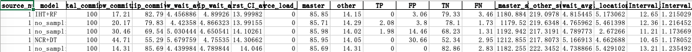

## CISimulator
This is the replication package for the article "The Why, When, What, and How about Predictive Continuous Integration: A Simulation-Based Investigation" by Bohan Liu et al.
This replication package contains the data we used, the scripts for processing the data, and the source file of CISimulator (i.e., the simulation model).

### File Structure
- PCI_TCP.alp: the source file of simulation model
- CISimulation: the scripts for processing the data
    ```
    CISimulation
	├── calibration
	├── data_process
	├── data_crawl.py
	├── predict
	└──projects
    ```
    - data_crawl.py: this script is used to crawl the data, which is saved in the directory project.
    - calibration: this module is used to calculate calibration variables.
    - predict: this mudule is used to train and evaluate the models.
    - data_process: this module is used to process the data generated by the simulation models.
- Data: the data we used

### PCI_TCP.alp
`PCI_TCP.alp` is the source file of our simulation model (CISimulator). The CISimulator is built to simulate the CI process to validate the effectiveness of the predictor. The model is built using AnyLogic (version 8.7.6). The content of CISimulator is shown in the figure.


  The model file contains four areas:

- Area 1 is the main model file.
- Area 2 is the simulation experimental configuration file, and it contains the experiment using predictors, random skip commits, and using no strategy.
- Area 3 is the model interface, and it contains components used in CISimulator.
- Area 4 is the model parameters.

### How to Run the Model?
- Step 1: Open (or create a new file if it does not exist) a simulation experiment configuration file, e.g. `People_PCI_A: Main` (Apply 5 real predictors respectively in project A).
- Step 2: The box `parameters` contains all parameters needed for a simulation experiment. Create an excel file, and set value for each parameter. Then click `calibrationFile` to configure the simulation configuration. 
- Step 3: Click `excelFile` to configure the simulation results output file (** it must be an empty excel file**)
- Step 4: Click the button in the red box below to run the simulation experiment.


The format of configuration excel file is like:


And the format of output file is like:


### CISimulation
This directory contains all the script used to process the data. It mainly contains three parts.
- Before runing the simulation model
  - Step 1: crawl data
  - Step 2: Calculate calibration variables     
     - calibration/CalibrationSplit.py: Calculate all calibration variables of the project, and the results are saved in the `calibration/output/calibration_split_data.xlsx` file. Each sheet in the file corresponds to the calibration variable information of a project.
    - calibration/CalibrationMerge.py: summarizes the simulation configuration items (including all calibration variables calculated by `CalibrationSplit.py`, and the four predictor description variables calculated by DataFeature_extract.py.
  - Step 3: Training & Evaluating Predictors
    - predict/DataFeature_extract.py:
      - The feature_extract() function calculates the feature data of the project, and the results are saved in the `predict/feature` directory.
      - The feature_process() function processes feature data, such as processing nan values, and the results are saved in the predict/feature_process directory.
    - predict/time_validation_split.py: Evaluate the performance of the predictor based on the sliced data of the project. The evaluation indicators include the four descriptive variables of the predictor ($fail_{ff}, fail_{pp}, pass_{ff}, and pass_{pp}$, and the results are saved in `predict/output/{pro}_predict_performance.xlsx`.

- Run the simulation model
- After running the model
  - Step 1: copy the output file from simulaiton model to the directory `./data_analysis/sim_data`
  - Step 2: run the script `data_process.py`. The example of output is below:
    

